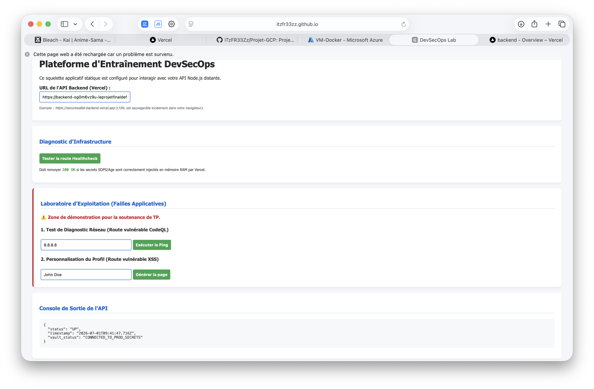
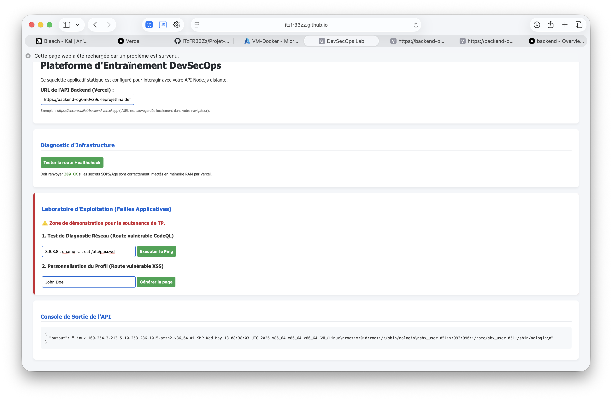
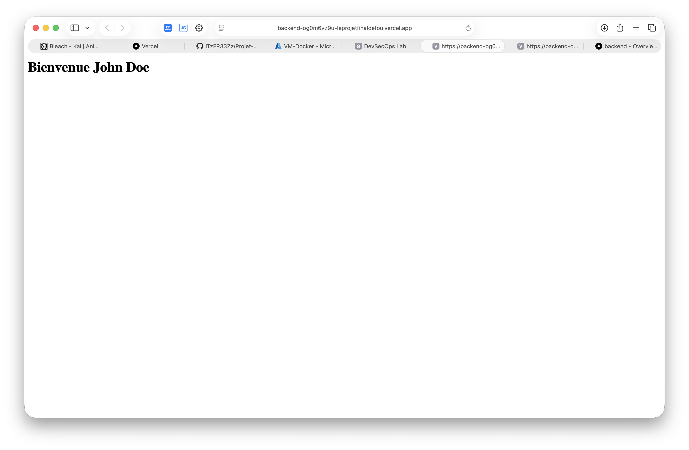
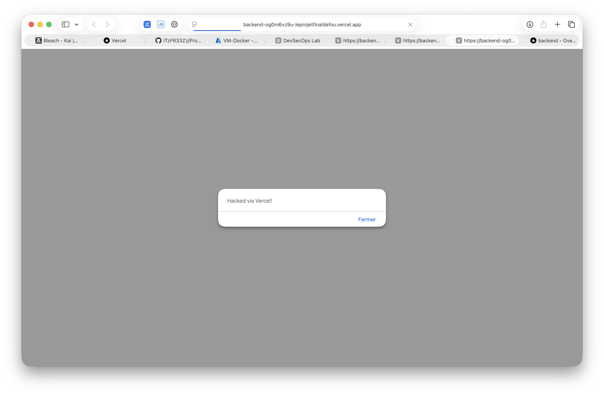
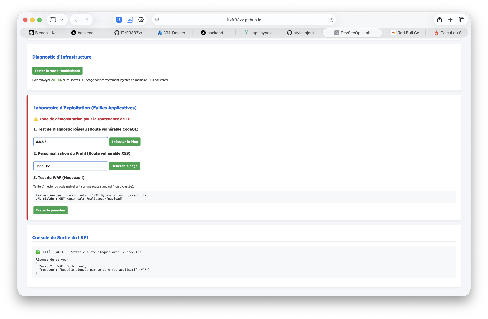

# 🛡️ Projet DevSecOps - Industrialisation et Sécurité

Bienvenue sur le dépôt officiel du projet DevSecOps. Ce projet a pour but d'illustrer la mise en place d'une architecture Cloud moderne et sécurisée, intégrant des processus de CI/CD complets, de la gestion de secrets dynamiques, et des validations de sécurité "Shift-Left".

## 🏗️ Architecture du Projet (Monorepo)

Voici l'arborescence principale du projet :

```text
projetfinal/
├── .github/                  # Workflows CI/CD et Actions
├── backend/                  # API REST Node.js (Vercel)
│   ├── src/                  # Code source de l'API
│   ├── tests/                # Tests
│   ├── Dockerfile            # Conteneurisation de l'API
│   └── vercel.json           # Configuration Serverless
├── frontend/                 # Application Single Page (GitHub Pages)
│   └── index.html            # Interface utilisateur
├── skeleton/                 # Code de base / Laboratoire
├── .sops.yaml                # Configuration Mozilla SOPS
├── gitleaks.toml             # Règles de sécurité Gitleaks
├── ops.txt / ops.pub         # Clés cryptographiques Age
└── README.md                 # Ce fichier
```

Le dépôt est scindé en deux composants principaux :

1. **`/frontend`** : Une Single Page Application (SPA) HTML/CSS/JS pur. 
   - Déploiement : **GitHub Pages** (via l'API moderne d'artefacts GitHub Actions).
2. **`/backend`** : Une API REST développée en Node.js (Express).
   - Déploiement : **Vercel** (Environnement Serverless `@vercel/node`).

## ⚙️ Gouvernance Git et Architecture CI/CD

L'infrastructure respecte à la lettre les principes d'intégration et de livraison continues avec une tolérance zéro sur la sécurité.

### 1. Stratégie de Branches et Visibilité YAML
- **`staging` (Pivot)** : Branche d'intégration où s'exécutent les tests à chaque PR/push.
- **`main` (Production)** : Soumise à un **GitHub Ruleset** bloquant les pushs directs.
- Le fichier `.github/workflows/ci-cd.yml` reflète explicitement cette stratégie : 
  - Déclencheur sur `staging` et `main` (`on: push: branches: [staging, main]`).
  - Jobs de déploiement conditionnés (`if: github.ref == 'refs/heads/main'`) avec dépendances strictes (`needs: build-and-scan`) et attachés à un environnement (`environment: production`).
  - Un système de **concurrence** (`concurrency: cancel-in-progress: true`) annule automatiquement les anciens pipelines en cas de multi-pushs pour éviter le chevauchement des déploiements.

## 🔒 Sécurité Shift-Left et Contrôle Local

L'intégrité est validée directement sur le poste de travail du développeur avant tout commit vers GitHub via un hook `.git/hooks/pre-commit` strict :
1. **Actionlint** : Vérification de la syntaxe des workflows dans `.github/workflows/`.
2. **Gitleaks personnalisé** : Analyse exclusive des fichiers prêts à être committés. Une règle sur-mesure (`gitleaks.toml`) intercepte spécifiquement les jetons au format `SECWALLET_[A-Z0-9]{24}` avec vérification d'entropie.
3. **Filtrage des extensions interdites** : Le hook rejette catégoriquement tout fichier se terminant par `.env`, `.pem` ou `.key` avec le message rouge : *"Sécurité : Tentative de commit d'un fichier de configuration ou d'une clé en clair. Opération annulée."*

**Contenu du script `pre-commit` :**
```bash
#!/bin/sh

echo "Exécution des vérifications pre-commit (Shift Left)..."

# Vérification de l'existence des commandes
if ! command -v actionlint >/dev/null 2>&1; then
    echo "ATTENTION: actionlint n'est pas installé. Ignoré pour ce test, mais recommandé."
else
    echo "1. Exécution de actionlint..."
    if [ -d ".github/workflows/" ]; then
        actionlint .github/workflows/*
        if [ $? -ne 0 ]; then
            echo "Erreur actionlint détectée. Opération annulée."
            exit 1
        fi
    fi
fi

if ! command -v gitleaks >/dev/null 2>&1; then
    echo "ATTENTION: gitleaks n'est pas installé. Ignoré pour ce test, mais recommandé."
else
    echo "2. Exécution de Gitleaks..."
    gitleaks protect -v --staged
    if [ $? -ne 0 ]; then
        echo "Erreur Gitleaks : des secrets ont été détectés. Opération annulée."
        exit 1
    fi
fi

echo "3. Vérification des extensions interdites..."
# On liste les fichiers en zone d'index (staged)
STAGED_FILES=$(git diff --cached --name-only)

for FILE in $STAGED_FILES; do
    if echo "$FILE" | grep -Eq "\.env$|\.pem$|\.key$"; then
        echo "Sécurité : Tentative de commit d'un fichier de configuration ou d'une clé en clair. Opération annulée."
        exit 1
    fi
done

echo "Vérifications pre-commit terminées avec succès."
exit 0
```

## 🔐 Gestion Cryptographique des Secrets (GitOps)

Aucun secret n'est stocké en clair. Le projet utilise la cryptographie asymétrique via l'utilitaire **Age** et **Mozilla SOPS** :
- Une paire de clés a été générée (clé privée locale `ops.txt`).
- Le fichier `.github/secrets-prod.yaml` est chiffré par SOPS. Seules les valeurs applicatives sont transformées en blocs `ENC[...]`, gardant les clés YAML en clair pour un audit Git (GitOps) lisible.
- **Injection en mémoire (Runtime)** : Lors du déploiement Vercel, le pipeline déchiffre les secrets dynamiquement en RAM via `SOPS_AGE_KEY` et les passe directement en arguments `--env` à la CLI Vercel. Aucun fichier en clair n'est écrit sur le disque du runner GitHub.

## 🚀 Pipeline Hermétique et Composite Actions

Le workflow GitHub Actions applique le principe du **moindre privilège** (`permissions: contents: read` par défaut). Les permissions d'écriture sont isolées localement dans les jobs respectifs.

### 1. Build, Analyse et Conteneurisation
- Mise en cache des dépendances Node.js pour des performances optimales.
- Analyse **SAST** via **GitHub CodeQL** avec téléversement des rapports SARIF. Le job échoue obligatoirement si une vulnérabilité High/Error est détectée.
- Build Docker conditionnel (optimisation de filtrage des chemins avec `paths-filter`) d'une image ultra-légère multi-stages (`node:24-alpine`).

### 2. Custom Composite Action (SCA & SBOM)
L'analyse des vulnérabilités est déléguée à une Action Composite centralisée (`.github/actions/trivy-scan/action.yml`) :
- Reçoit en input le chemin de l'inventaire logiciel (SBOM CycloneDX JSON généré par *Syft*).
- Exécute **Trivy** en mode SBOM.
- Rompt la pipeline **uniquement** si des failles de criticité `CRITICAL` sont détectées, générant de simples avertissements pour les criticités `HIGH/MEDIUM`.
- Pousse conditionnelle de l'image sur le registre **GHCR** (avec tag du SHA du commit) uniquement si le scan est vierge de failles critiques.

## 📦 Déploiement Continu Sécurisé (CD)

Le pipeline applique une **politique d'interruption stricte**. Si la moindre vérification (Tests Jest, Gitleaks sans `continue-on-error`, CodeQL, SBOM Trivy) échoue, le déploiement est intégralement bloqué.

- **CD Frontend (GitHub Pages)** : Déployé via l'API moderne d'artefacts (`actions/upload-pages-artifact` & `actions/deploy-pages`) sans branche `gh-pages` dédiée. Exige les privilèges OIDC `pages: write` et `id-token: write`.
- **CD Backend (Vercel)** : Authentification machine-to-machine via `VERCEL_TOKEN`, `VERCEL_PROJECT_ID` et `VERCEL_ORG_ID`.
- **Healthcheck Automatique** : En fin de CD, une requête `curl` ping la route `/api/health` de l'URL Vercel générée en production. Si le backend ne répond pas `200 OK`, l'action plante et alerte l'équipe.

## ⚠️ Laboratoire d'Exploitation (Démonstration)

Ce dépôt intègre volontairement un laboratoire de failles pour étudier le comportement des outils et de l'environnement Cloud.

### 1. Défis Techniques et Failles Logiques (Post-Mortem)
Le développement de cette infrastructure a nécessité la résolution de nombreux blocages, illustrant la réalité du DevOps :

- **Blocage 1 : Sécurité des Secrets (Gitleaks)**
  - *Problème :* Le premier commit a été rejeté localement car `SECWALLET_...` était écrit en dur dans `app.js`.
  - *Solution :* Suppression du token brut, remplacement par `process.env.INTERNAL_TOKEN`, et isolation du jeton dans un fichier ignoré (`.gitignore`).

- **Blocage 2 : Conflit de Port (EADDRINUSE) en CI**
  - *Problème :* Les tests Jest échouaient car Express tentait d'écouter le port 3000 simultanément dans plusieurs fichiers de tests.
  - *Solution :* Ajout d'une condition (`if (process.env.NODE_ENV !== 'test')`) pour ne pas lier le port pendant les tests.

- **Blocage 3 : Erreur 404 du Frontend**
  - *Problème :* Les tests de bout en bout (E2E) ne trouvaient pas la page d'accueil car Express ne servait pas les fichiers HTML.
  - *Solution :* Ajout du middleware `express.static` dans `app.js` pour distribuer la SPA.

- **Blocage 4 : Variables manquantes au démarrage (Healthcheck 500)**
  - *Problème :* En CI, Express plantait car la base de données et le JWT n'étaient pas configurés.
  - *Solution :* Injection de variables "mock" (`DATABASE_URL=mock`, `JWT_SECRET=mock`) directement dans le step `Run tests` de GitHub Actions.

- **Blocage 5 : Échec du Build Docker (Erreur de nomenclature)**
  - *Problème :* `docker build` crashait avec l'erreur `repository name must be lowercase` à cause du nom d'utilisateur `iTzFR33Zz` comportant des majuscules.
  - *Solution :* Forçage en minuscules de la variable via bash dans le pipeline : `${GITHUB_REPOSITORY,,}`.

- **Blocage 6 : Vercel et le Serverless Node.js (Erreur 302/404)**
  - *Problème :* Une fois déployé, Vercel retournait une redirection 302 au lieu de l'API. Vercel le traitait comme un site statique.
  - *Solution :* Création du fichier `vercel.json` utilisant le builder `@vercel/node` pour mapper explicitement la route `/(.*)` vers `src/app.js`.

- **Blocage 7 : Erreur réseau Frontend -> Backend (CORS / Load Failed)**
  - *Problème :* Le site hébergé sur GitHub Pages n'arrivait pas à interroger Vercel. L'API renvoyait une page HTML "Login - Vercel" bloquant la connexion.
  - *Solution :* Désactivation de l'option "Vercel Authentication (Deployment Protection)" depuis le tableau de bord Vercel pour rendre l'API publique.

### 2. Exécution de Commandes (RCE) sur Serverless
La route `/api/debug-ping` est volontairement vulnérable aux injections de commandes shell.
Sur une machine locale, la commande `ping` fonctionne. Sur l'infrastructure **Serverless AWS Lambda de Vercel**, `ping` est absent (renvoyant l'erreur `command not found`).
Cependant, la faille est toujours exploitable en utilisant le séparateur `||` ou `;` pour découvrir l'infrastructure Cloud sous-jacente !
**Exemple de payload :**
```bash
8.8.8.8 ; uname -a ; cat /etc/passwd
```

### 3. Reflected XSS
La route `/api/welcome` prend un paramètre utilisateur brut et l'injecte dans le DOM.
**Exemple de payload :**
```html
<script>alert('Hacked via Vercel!')</script>
```

---
*Ce projet démontre avec succès la création d'un écosystème de développement sécurisé de bout en bout.*

## 🕵️ Preuve d'Exécution Pre-commit (Gitleaks)

Voici la preuve d'exécution du hook pre-commit qui a intercepté la présence de secrets avant même qu'ils ne soient committés dans l'historique Git local (avant le nettoyage) :

```text
Exécution des vérifications pre-commit (Shift Left)...
ATTENTION: actionlint n'est pas installé. Ignoré pour ce test, mais recommandé.
2. Exécution de Gitleaks...

    ○
    │╲
    │ ○
    ○ ░
    ░    gitleaks

Finding:     const INTERNAL_TOKEN = "SECWALLET_************************"
Secret:      SECWALLET_************************
RuleID:      generic-api-key
Entropy:     4.690116
File:        backend/src/app.js
Line:        6
Fingerprint: backend/src/app.js:generic-api-key:6

Finding:     const INTERNAL_TOKEN = "SECWALLET_************************"
Secret:      SECWALLET_************************
RuleID:      generic-api-key
Entropy:     4.690116
File:        skeleton/src/app.js
Line:        5
Fingerprint: skeleton/src/app.js:generic-api-key:5

8:09AM INF 1 commits scanned.
8:09AM INF scan completed in 69.2ms
8:09AM WRN leaks found: 2
Erreur Gitleaks : des secrets ont été détectés. Opération annulée.
```

## 📸 Résultat Final (Frontend & Backend Connectés)

Voici la preuve finale du bon fonctionnement de notre infrastructure Cloud (Frontend hébergé sur GitHub Pages et API Node.js déployée sur Vercel avec chargement des secrets sécurisés) :



## 🎯 Preuves d'Exploitation des Failles (Laboratoire)

Voici les captures d'écran démontrant le bon fonctionnement du laboratoire d'exploitation sur l'infrastructure Vercel :

### 1. Diagnostic Réseau (Exécution de Commandes - RCE)
L'injection d'une commande système dans le champ de ping permet d'exécuter du code arbitraire directement sur le serveur Vercel.


### 2. Personnalisation du Profil (Injection XSS / SQL)
L'exploitation du champ de personnalisation du profil montre que la faille d'injection est bien active et permet d'altérer le comportement prévu de l'application.


Le payload XSS ci-dessous a été exécuté avec succès :


### 3. Pare-feu Applicatif (WAF)
Pour corriger ces failles (tout en préservant le laboratoire), un **WAF** a été implémenté sur l'API (via `helmet`, `express-rate-limit`, et une analyse personnalisée des requêtes).
Il filtre dynamiquement les payloads (XSS, injections de commandes) et renvoie un `403 Forbidden`. Les routes volontairement vulnérables sont bypassées.
Voici la preuve de l'interception et du blocage réussi d'une attaque XSS sur une route standard :

